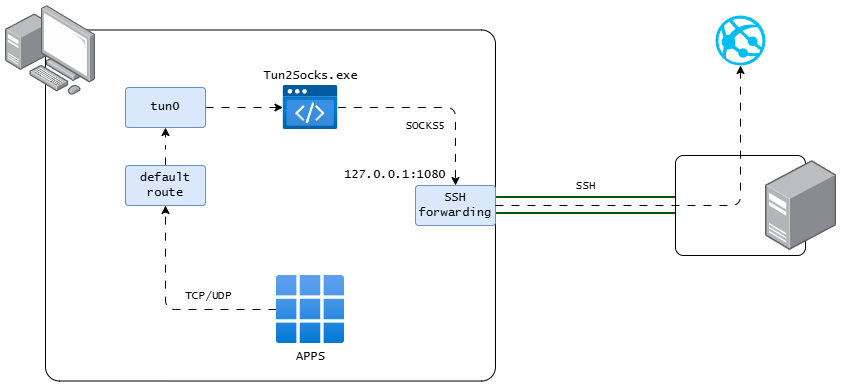
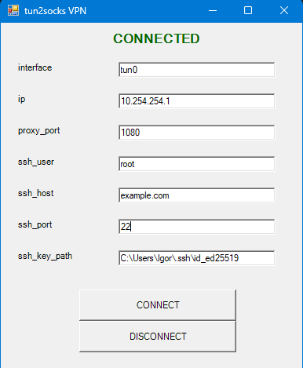

## SSH tunnel

---

Скрипт для запуска ssh-туннеля на Windows.

Используется для проброса всего трафика через SSH подключение.




## Требования

1. Для работы требуется установленная программа [Tun2Socks](https://github.com/xjasonlyu/tun2socks) (`tun2socks-windows-amd64.exe`).
2. Драйвер [wintun.dll](https://www.dllme.com/dll/files/wintun)


Всё необходимое вы можете скачать сразу архивом по [ссылке](https://github.com/ig-rudenko/ssh-tunnel/releases).

Также вы можете сами скачать tun2socks новой версии [здесь](https://github.com/xjasonlyu/tun2socks/releases)
и wintun [здесь](https://www.dllme.com/dll/files/wintun).
Затем поместите эти файлы в корень проекта. Также проверьте, что исполняемый файл tun2socks 
называется именно `tun2socks-windows-amd64.exe` это важно.


## Запуск

Загрузите последний релиз по [ссылке](https://github.com/ig-rudenko/ssh-tunnel/releases).

SSH подключение с сервером устанавливается с помощью ключей, а не пароля, так что убедитесь, что у вас они имеются.

Запускайте программу через файл `ssh-tunel.bat` от имени администратора.

Либо через PowerShell от имени администратора:

```powershell
powershell -ExecutionPolicy Bypass -File ssh-tunel.ps1
```

После запуска у вас появится окно с настройками, а также терминал с логами.

- interface: интерфейс, через который будет проходить трафик (создается автоматически)
- ip: ip-адрес, который будет использоваться для подключения (укажите не занятый адрес)
- proxy_port: порт, который будет использоваться для SOCKS-прокси (укажите свободный)
- ssh_user: имя пользователя
- ssh_host: хост
- ssh_port: порт
- ssh_key: путь к приватному ключу

Далее нажмите кнопку "CONNECT" и подождите пока установится соединение.

